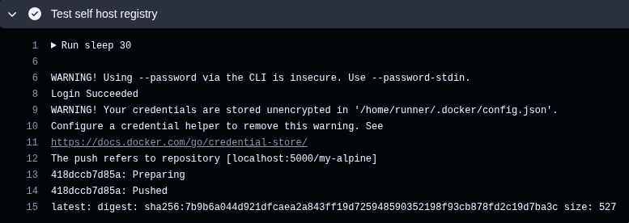
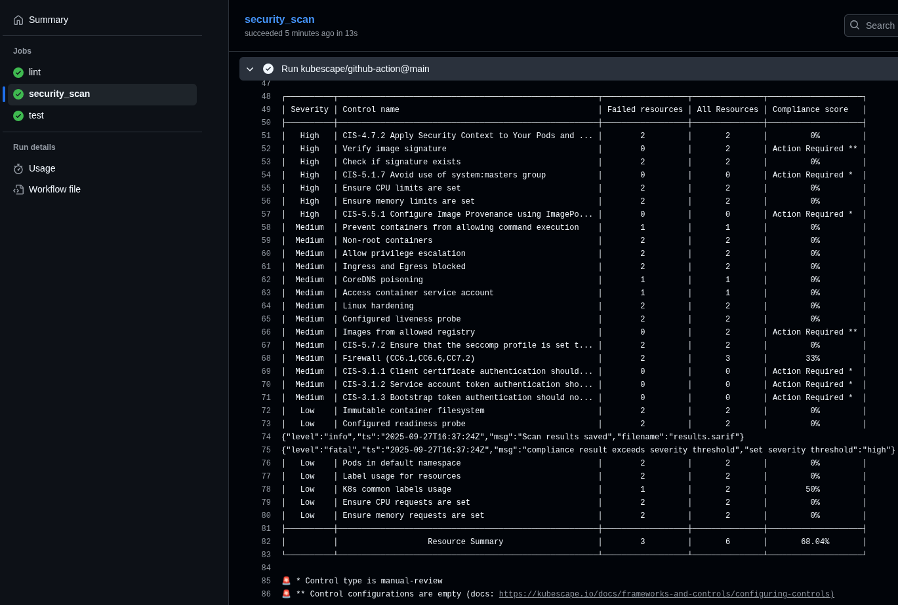

# Docker Registry Helm Chart

## Overview

This Helm chart deploys a private Docker registry on a Kubernetes cluster using the official `registry:2` image. It supports customization via Helm values, including authentication with custom user accounts, network security with custom domains via Ingress, periodic garbage collection with configurable frequency, and Redis for metadata caching.

The chart optionally deploys a Redis instance for caching. Garbage collection is handled via a CronJob that safely scales down the registry, performs GC, and scales it back up. This requires the storage to be ReadWriteOnce, but the GC process handles it by temporarily stopping the registry.

## More info

- Disclaimer: I'm using AI to generate most of the template to reduce boilerplate.

For further information, please check output of the pipeline

Also I tried to apply CI scan for helm chart configuration

