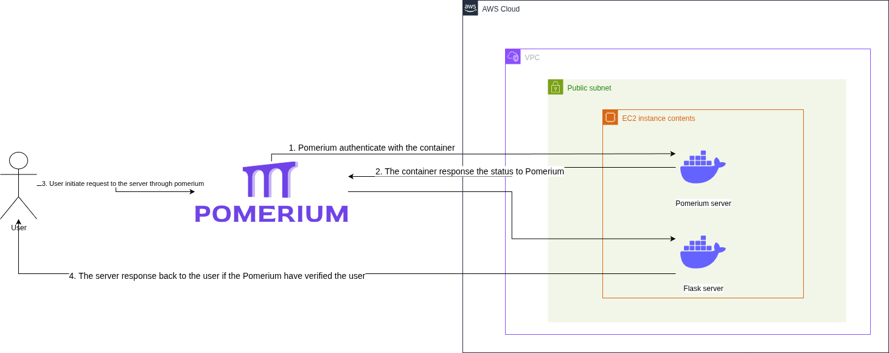
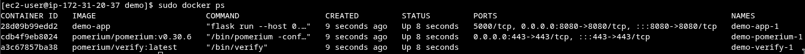
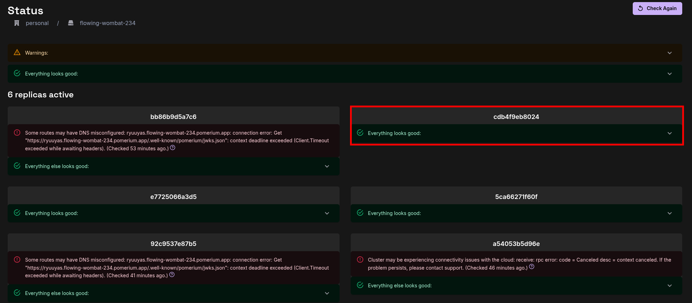
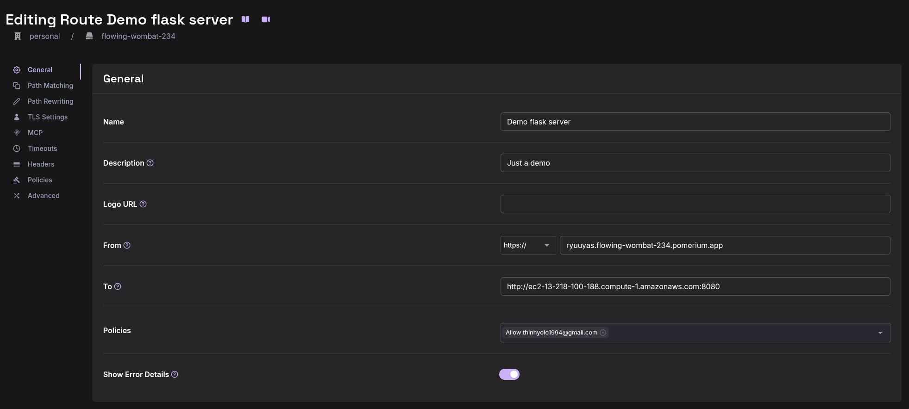
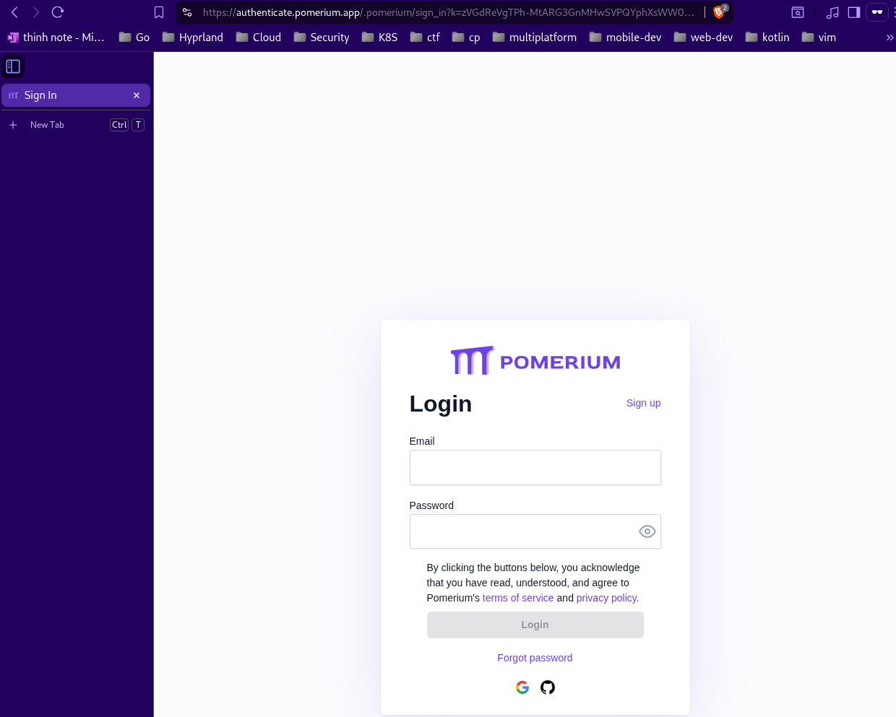
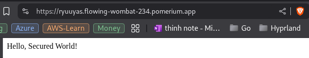

# Deployment of a Simple Application Secured by IAP

## Step-by-Step Deployment Demonstration

### Design



### Steps

1. **Set Up Your Project**:

   - Create account in Pomerium.

2. **Deploy a Simple Application to EC2 instance**:

   - Create a simple Dockerfile for a "Hello World" app using flask.

     ```
     from flask import Flask
     app = Flask(__name__)
     @app.route('/')
     def hello():
         return "Hello, Secured World!"
     if __name__ == '__main__':
         app.run(host='0.0.0.0', port=8080)
     ```

     Requirements: `flask`.

   - Create a docker compose file with Pomerium service, replace the `POMERIUM_ZERO_TOKEN`:

     ````
      services:
        pomerium:
          image: pomerium/pomerium:v0.30.6
          ports:
            - 443:443
          restart: always
          environment:
            POMERIUM_ZERO_TOKEN: <INSERT_TOKEN_HERE>
            XDG_CACHE_HOME: /var/cache
          volumes:
            - pomerium-cache:/var/cache
          networks:
            main:
              aliases:
                - verify.flowing-wombat-234.pomerium.app
        verify:
          image: pomerium/verify:latest
          networks:
            main:
              aliases:
                - verify

        app:
          build:
            dockerfile: Dockerfile
          ports:
            - "8080:8080"

      networks:
        main: {}

      volumes:
        pomerium-cache:
          ```
     ````

   

3. **Configure Pomerium**:

   - Go to the Pomerium Console.
   - In the Status page, verify the Pomerium container id that is being created to make sure it's setup correctly
     
   - In the Rule page, create a custom rule with default policy that allow owner ip
     

4. **Test Access**:

   - Get the generated URL.
     
   - Access it: You'll be prompted to sign in with an authorized account.
     
